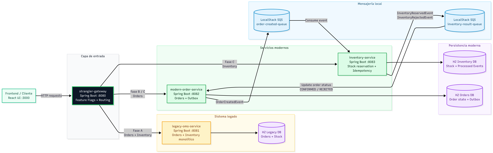

# Strangler Fig OMS Demo
# Link Video Demo: https://youtu.be/zX-yPGpiyy8

Demo academico local de modernizacion incremental de un sistema OMS retail usando el patron Strangler Fig.  
El cliente consume una unica entrada publica (`http://localhost:8080`) y el gateway enruta internamente entre legacy y servicios modernos segun flags de migracion.

## Tabla de contenido

- [1. Resumen del proyecto](#1-resumen-del-proyecto)
- [2. Patron Strangler Fig](#2-patron-strangler-fig)
- [3. Arquitectura](#3-arquitectura)
- [4. Tecnologias](#4-tecnologias)
- [5. Requerimientos](#5-requerimientos)
- [6. Ejecucion en modo desarrollo](#6-ejecucion-en-modo-desarrollo)
- [7. Ejecucion con Docker Compose](#7-ejecucion-con-docker-compose)
- [8. Flujo de uso del demo (paso a paso)](#8-flujo-de-uso-del-demo-paso-a-paso)
- [9. Endpoints principales](#9-endpoints-principales)
- [10. Fases A B C de migracion](#10-fases-a-b-c-de-migracion)
- [11. Consistencia eventual](#11-consistencia-eventual)
- [12. Historial y convergencia de ordenes](#12-historial-y-convergencia-de-ordenes)
- [13. Verificacion](#13-verificacion)


##  Autores

- Roger Alexander Rodriguez Abril
- Juan Esteban Cely Lopez

## 1. Resumen del proyecto

Este proyecto demuestra como modernizar un OMS sin una reescritura total. El escenario parte de un servicio legacy monolitico (`legacy-oms-service`) y migra capacidades de forma incremental hacia servicios modernos independientes.

La migracion se realiza por capacidades:

- Ordenes modernas en `modern-order-service`.
- Inventario moderno en `inventory-service`.
- Contratos externos estables a traves de `strangler-gateway`.

El objetivo es academico: visualizar coexistencia legacy/moderno, enrutamiento gradual, rollback por flags y consistencia eventual por eventos asincronos.

Este demo **no** despliega infraestructura AWS real. La simulacion es local con Spring Boot, Docker Compose, H2 y LocalStack.

## 2. Patron Strangler Fig

El patron Strangler Fig encapsula un sistema legado detras de una fachada estable y extrae funcionalidades de manera progresiva. Esto reduce riesgo operativo frente a una reescritura completa, porque el cambio se puede controlar por etapas.

En este repositorio, la fachada es el gateway. El cliente no cambia URL ni contrato base mientras la logica interna evoluciona. Con flags de migracion, el trafico puede dirigirse a legacy o a servicios modernos segun la fase.

Las capacidades nuevas se desacoplan en servicios con persistencia independiente. La integracion entre ordenes e inventario modernos se resuelve de forma asincrona con eventos en LocalStack/SQS, lo que permite explicar convergencia eventual de estado.

| Concepto del patron | Implementacion en este demo |
|---|---|
| Fachada / entrada unica | `strangler-gateway` |
| Sistema legacy | `legacy-oms-service` |
| Nueva capacidad de ordenes | `modern-order-service` |
| Nueva capacidad de inventario | `inventory-service` |
| Migracion gradual | Flags de migracion (`/migration/...`) |
| Integracion asincrona | LocalStack + colas SQS |
| Consistencia eventual | `PENDING` -> `CONFIRMED` / `REJECTED` |

## 3. Arquitectura


| Componente | Puerto | Responsabilidad |
|---|---:|---|
| strangler-gateway | 8080 | Entrada unica, routing y fallback |
| legacy-oms-service | 8081 | OMS legado (ordenes + inventario) |
| modern-order-service | 8082 | Ordenes modernas, outbox y estado |
| inventory-service | 8083 | Inventario moderno, consumo e idempotencia |
| LocalStack (SQS) | 4566 | Mensajeria asincrona local |
| Frontend Vite (dev) | 5173 | Dashboard de demostracion |
| Frontend Docker | 3000 | Dashboard en Compose |

## 4. Tecnologias

| Capa | Tecnologias |
|---|---|
| Backend | Java 21, Spring Boot 3.3.x, Maven multi-modulo |
| Persistencia | Spring Data JPA + H2 (una base por servicio) |
| Mensajeria | AWS SDK v2 (SQS) sobre LocalStack local |
| Frontend | React 18, TypeScript, Vite |
| Contenedores | Docker + Docker Compose |
| Observabilidad minima | Spring Boot Actuator, logs con `correlationId` |

## 5. Requerimientos

- Java 21
- Maven 3.9+
- Node.js 20.19+ o 22.12+ con npm
- Docker y Docker Compose

## 6. Ejecucion en modo desarrollo

1. Levantar LocalStack:

```bash
docker compose up -d localstack
```

2. Levantar servicios backend (terminales separadas):

```bash
mvn -pl legacy-oms-service spring-boot:run
mvn -pl modern-order-service spring-boot:run
mvn -pl inventory-service spring-boot:run
mvn -pl strangler-gateway spring-boot:run
```

3. Levantar frontend:

```bash
cd frontend
npm install
npm run dev
```

4. Accesos:

- Frontend dev: `http://localhost:5173`
- Gateway API: `http://localhost:8080`
- Health gateway: `http://localhost:8080/actuator/health`

## 7. Ejecucion con Docker Compose

Levantar todo el entorno:

```bash
docker compose up --build -d
```

Accesos principales:

- Frontend: `http://localhost:3000`
- Gateway API: `http://localhost:8080`
- Health gateway: `http://localhost:8080/actuator/health`

Detener:

```bash
docker compose down
```

Reiniciar con limpieza de volumenes:

```bash
docker compose down -v
docker compose up --build -d
```

## 8. Flujo de uso del demo (paso a paso)

1. Abrir el frontend (`5173` en dev o `3000` en Docker).
2. Verificar estado del gateway.
3. Confirmar fase inicial (A): migraciones desactivadas.
4. Crear una orden y observar backend `LEGACY`.
5. Activar migracion de ordenes.
6. Crear otra orden y observar backend `MODERN_ORDER` con estado inicial `PENDING`.
7. Activar migracion de inventario.
8. Crear una orden moderna y observar convergencia a `CONFIRMED` o `REJECTED`.
9. Consultar inventario y validar backend `INVENTORY_SERVICE`.
10. Probar rollback desactivando flags de migracion.

## 9. Endpoints principales

Todos los endpoints publicos se consumen por el gateway:

| Metodo | Endpoint | Proposito |
|---|---|---|
| POST | `/orders` | Crear orden |
| GET | `/orders/{id}` | Consultar orden |
| GET | `/inventory/{sku}` | Consultar inventario |
| POST | `/migration/orders/enable` | Activar migracion de ordenes |
| POST | `/migration/orders/disable` | Desactivar migracion de ordenes |
| POST | `/migration/inventory/enable` | Activar migracion de inventario |
| POST | `/migration/inventory/disable` | Desactivar migracion de inventario |
| GET | `/migration/status` | Estado actual de flags de migracion |

## 10. Fases A B C de migracion

| Fase | ordersEnabled | inventoryEnabled | Comportamiento |
|---|---:|---:|---|
| A | false | false | `POST /orders` y `GET /inventory/{sku}` en `LEGACY` |
| B | true | false | `POST /orders` en `MODERN_ORDER`; inventario publico sigue en legacy |
| C | true | true | `POST /orders` en moderno y `GET /inventory/{sku}` en `INVENTORY_SERVICE` |

## 11. Consistencia eventual

En fases B y C, una orden moderna inicia en `PENDING`. El flujo asincrono es:

1. `modern-order-service` crea la orden y publica `OrderCreatedEvent`.
2. `inventory-service` consume el evento y decide reserva/rechazo.
3. `inventory-service` publica `InventoryReservedEvent` o `InventoryRejectedEvent`.
4. `modern-order-service` consume el resultado y actualiza el estado final.

Este enfoque ilustra consistencia eventual: la respuesta inicial puede no ser el estado final, pero el sistema converge de forma determinista.

## 12. Historial y convergencia de ordenes

El historial del frontend se mantiene sobre la URL publica del gateway y permite observar la evolucion real de cada orden:

- Una orden creada en fase B o C permanece en el dominio moderno.
- Cambiar la fase modifica el routing futuro, no reubica datos historicos.
- `PENDING` representa estado transitorio.
- `CONFIRMED` o `REJECTED` aparecen cuando llega el resultado de inventario.

Esto permite explicar por que una migracion incremental puede convivir con datos legacy y modernos al mismo tiempo.

## 13. Verificacion

Desde la raiz del proyecto:

```bash
mvn clean verify
```

```bash
cd frontend
npm install
npm run build
```

```bash
docker compose config
```

Validaciones rapidas de salud:

```bash
curl http://localhost:8080/actuator/health
curl http://localhost:8080/migration/status
```


